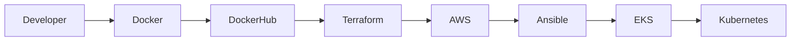

# ☁️ Cloud-Native Multi-Stack Voting Application

> **End-to-End DevOps Project on AWS**
>
> A production-style portfolio project demonstrating the evolution of a microservices application from local development to cloud-native deployment using Docker, Terraform, Ansible, Kubernetes, and Amazon EKS.


---

# 📑 Table of Contents
1. Project Overview
2. Project Objectives
3. Project Evolution
4. Architecture
5. Application Workflow
6. Technology Stack
7. Repository Structure
8. Phase 1 – Docker
9. Phase 2 – Docker Compose
10. Phase 3 – Terraform
11. Phase 4 – AWS Infrastructure
12. Phase 5 – Ansible
13. Phase 6 – Amazon EKS
14. Phase 7 – Kubernetes
15. Challenges & Solutions
16. Screenshots
17. Skills Demonstrated
18. Future Roadmap
19. Cleanup
20. Author

# 📖 Project Overview

This repository documents the complete evolution of the same Multi‑Stack Voting Application through multiple stages of the DevOps lifecycle. Rather than stopping after a single deployment method, the application was progressively improved using industry-standard tools and practices.

# 🎯 Objectives

- Containerize a multi-service application
- Test locally using Docker Compose
- Provision AWS infrastructure using Terraform
- Automate deployment with Ansible
- Deploy the application to Amazon EKS using Kubernetes
- Document the complete DevOps journey

# 📈 Project Evolution

```text
Python
   ↓
Docker
   ↓
Docker Compose
   ↓
Terraform
   ↓
AWS Infrastructure
   ↓
Ansible
   ↓
Amazon EKS
   ↓
Kubernetes
```

# 🏗️ Architecture (Mermaid)



# 🔄 Application Workflow

```text
Vote → Redis → Worker → PostgreSQL → Result
```

# 🛠️ Technology Stack

| Category | Technologies |
|---|---|
| Programming | Python, .NET, Node.js |
| Containers | Docker, Docker Compose |
| IaC | Terraform |
| Cloud | AWS |
| Configuration | Ansible |
| Orchestration | Kubernetes, Amazon EKS |
| SCM | Git & GitHub |

# 📂 Repository Structure

```text
terraform/
ansible/
k8s/
vote/
worker/
result/
screenshots/
README.md
```

# 🚀 Phase 1 – Docker
- Built custom images
- Multi-architecture builds
- Published to Docker Hub

# 🚀 Phase 2 – Docker Compose
- Local multi-container testing
- Service communication verification

# 🚀 Phase 3 – Terraform
- VPC
- Public & Private Subnets
- Internet Gateway
- NAT Gateway
- Security Groups
- EC2
- S3 Backend
- DynamoDB Lock Table

# 🚀 Phase 4 – AWS Infrastructure
Infrastructure deployed on AWS with isolated networking and bastion access.

# 🚀 Phase 5 – Ansible
- Docker installation
- Image deployment
- Container startup
- Verification

# 🚀 Phase 6 – Amazon EKS
- Cluster creation
- Worker nodes
- kubectl configuration

# 🚀 Phase 7 – Kubernetes
- Deployments
- Services
- Application verification
- External access to Vote and Result

# 🐞 Challenges & Solutions

## Redis environment variable conflict
**Problem:** Kubernetes injected environment variables that conflicted with the application.

**Solution:** Explicitly configured Redis host and port, then redeployed and verified the pods.

# 📸 Screenshots

Add screenshots for:
- Docker Compose
- Terraform Apply
- EC2
- Ansible Playbook
- EKS Cluster
- kubectl get pods
- kubectl get services
- Vote App
- Result App

# 🎓 Skills Demonstrated

- Docker
- Docker Compose
- Terraform
- AWS Networking
- EC2
- Ansible
- Kubernetes
- Amazon EKS
- Git
- Troubleshooting

# 🗺️ Future Roadmap

- GitHub Actions CI/CD
- NGINX Ingress
- Kubernetes Secrets
- HTTPS (cert-manager)
- Amazon ECR
- Amazon RDS
- Amazon ElastiCache
- Prometheus & Grafana
- Horizontal Pod Autoscaler

# 🧹 Cleanup

```bash
cd terraform
terraform destroy
```

# 👩‍💻 Author

**Sushmitha Ravi**

This repository represents my learning journey from local development to cloud-native deployment using modern DevOps practices.
